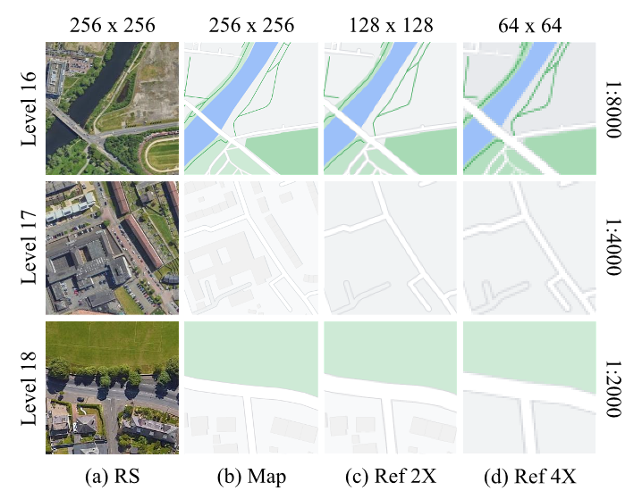

# Bridging Scales in Map Generation: A scale-aware cascaded generative mapping framework for consistent multi-scale cartographic representation

**Authors:** Chenxing Sun, Yongyang Xu, Xuwei Xu, Xixi Fan, Jing Bai, Xiechun Lu, and Zhanlong Chen.
**Contact:** Zhanlong Chen (chenzl@cug.edu.cn)

## Overview

This repository contains the official implementation and the CSCMG dataset for the paper: "Bridging Scales in Map Generation: A scale-aware cascaded generative mapping framework for consistent multi-scale cartographic representation".

Multi-scale tile maps are essential for geographic information services. While existing image generation networks can produce map-like outputs from remote sensing imagery, they often emphasize texture replication over preserving geospatial features, limiting cartographic validity. Current approaches face challenges in integrating cartographic generalization principles with dynamic multi-scale generation and suffer from spatial discontinuities due to tile-wise generation.

To address these limitations, we propose **SCGM**, a **S**cale-aware **C**artographic **G**enerative **M**apping framework that leverages conditional guided diffusion and a multi-scale cascade architecture. SCGM hierarchically constrains large-scale map synthesis with small-scale structural priors, effectively mitigating edge artifacts while maintaining geographic fidelity.

## Key Innovations

The SCGM framework introduces three key innovations:

1. A **scale modality encoding mechanism** to formalize map generalization relationships.
2. A **scale-driven conditional encoder** for robust feature fusion.
3. A **cascade reference mechanism** ensuring cross-scale visual consistency.

Our contributions include:

* Developing a scale-modality encoding mechanism for data-driven embedding of multi-scale cartographic knowledge priors.
* Eliminating edge discontinuities and maintaining semantic coherence across scales by using smaller scale map tiles as spatial constraints in a cascaded generation strategy.
* A dual-branch scale-adaptation network that extracts complementary features from remote sensing imagery guided by cascaded references.

## Framework Architecture

The SCGM framework employs a hierarchical, self-cascading pipeline that progressively synthesizes multi-scale tile maps by refining smaller-scale outputs under explicit scale conditioning.

*Figure 1: Overview of the SCGM framework: a hierarchical, self-cascading pipeline that progressively synthesizes multi-scale tile maps by refining smaller-scale outputs under explicit scale conditioning.*

The framework comprises three core modules:

* **ScaleEncoder:** Embeds scale-related spatial context.
* **MFEncoder:** Fuses semantic features from remote sensing imagery and cascading references.
* **SFAdapter:** Aligns multi-scale features with the denoising trajectory.

## CSCMG Dataset

We introduce the **C**ross-**S**cale **C**ascade **M**ap **G**eneration (CSCMG) dataset, comprising real-world remote sensing images and tile maps from Glasgow and London, UK. CSCMG pairs multi-scale tile maps (scales 1:35, 000 to 1:2, 000) with corresponding imagery and includes scale information (map scale, level, resolution, feature types).

**Dataset Details:**

* Total Pairs: 137, 042
  + Training set: 135, 571 pairs
  + Testing set: 1, 471 pairs
* Scales: 1:35, 000, 1:15, 000, 1:8, 000, 1:4, 000, 1:2, 000
* Source: Google Maps' free tile service

| Level                                                   | Tile pair number (Training) | Tile pair number (Testing) | Scale     | Resolution (m/pixel) | Feature types          |
| :------------------------------------------------------ | :-------------------------- | :------------------------- | :-------- | :------------------- | :--------------------- |
| 14                                                      | 4870                        | 280                        | 1:35, 000 | 9.555                | village, or suburb     |
| 15                                                      | 15106                       | 292                        | 1:15, 000 | 4.777                | small road             |
| 16                                                      | 30040                       | 300                        | 1:8, 000  | 2.389                | street                 |
| 17                                                      | 40555                       | 300                        | 1:4, 000  | 1.194                | block, park, addresses |
| 18                                                      | 45000                       | 300                        | 1:2, 000  | 0.597                | some buildings, trees  |
| All                                                     | 135571                      | 1471                       | -         | -                    | -                      |
| *Table 1: Detailed information of the CSCMG dataset.* |                             |                            |           |                      |                        |

*Figure 2: Examples of RS-Map tile sample pairs from scales 1:35, 000 to 1:2, 000 in the CSCMG dataset.*

*Figure 3: Examples of cascade references from scales of 1:8, 000 to 1:2, 000 in the CSCMG dataset. The dataset provides 2X or 4X cascade references, with image resolutions of 128 and 64.*

**Dataset Download:**
The CSCMG dataset will be open-sourced in this repository.
Download link: [Google Drive](https://drive.google.com/file/d/1F7VHOVY8B0ANzUu22DXQ1pvlQb6_wOv2/view?usp=sharing) or [Baidu Pan](https://pan.baidu.com/s/12riGjy2vnHnf5t-VxPfKkA?pwd=6nc9)

## Experimental Results

### Qualitative Comparison

SCGM demonstrates superior seamless tile synthesis and geographic detail preservation across scales compared to baseline methods.

*Figure 4: Generated results on the MLMG-US test set using SCGM and baseline methods, highlighting SCGM’s superior seamless tile synthesis and geographic detail preservation across scales.*

### Seamless Tile Map Generation

SCGM is capable of generating seamless, multi-scale, large-format, and virtually limitless tile maps.

*Figure 5: Seamless tile map generation: SCGM demonstrates powerful capabilities on generating seamless, multi-scale, large-format, and virtually limitless tile maps.*

### Ablation Studies Visuals

Incremental visual results showcase improvements with the addition of cascade referencing (MFEncoder) and scale encoding (ScaleEncoder).

*Figure 6: Incremental visual results showcasing seamless, high-quality tile map generation with the addition of cascade referencing (MFEncoder) and scale encoding (ScaleEncoder). The orange box highlights fine-grained map details contributed by cascade references, while the red box denotes enhanced scale representation from scale encoding.*

## Getting Started

### Prerequisites

* PyTorch
* Stable Diffusion (SD-2.1-base)
* (List other dependencies)
